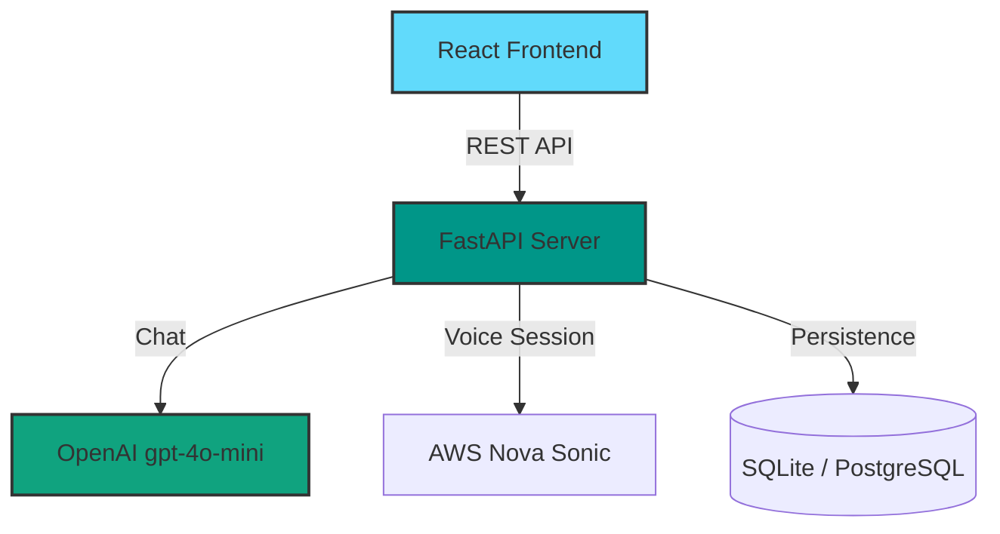

# allAgent - AI-Powered Insurance Assistant 🛡️

**allAgent** is a next-generation insurance assistance platform designed to bridge the gap between insurers and policyholders using advanced AI. It features a dual-mode interaction system (Chat & Voice) backed by a robust, persistent memory layer.

## 🌟 Key Features

### 🧠 Intelligent Core
- **Hybrid AI Architecture**: 
  - **Chat**: Low-cost, high-intelligence reasoning via **OpenAI gpt-4o-mini**.
  - **Voice**: Real-time speech-to-speech capabilities via **AWS Nova Sonic** (integration ready).
- **Shared Memory Layer**: seamlessly maintains context across both text and voice sessions.
- **Structured Data Extraction**: Automatically builds user profiles (Age, Location, Interests) from natural conversation.

### 📱 User Experience
- **Mobile-First Design**: Accessible interface optimized for rural and elderly users.
- **Multimodal Interaction**: Switch between typing and speaking instantly.
- **Smart Document Scanner**: Client-side OCR (Tesseract.js) to digitize policy documents.
- **Localization**: Native support for English and Hindi.

### 💻 Admin Dashboard
- **Analytics**: Real-time visualization of claims and user demographics.
- **Regional Heatmaps**: Interactive map of insurance coverage.
- **Claims Management**: Full administrative control over policy workflows.

---

## 🏗️ Architecture

The system follows a modern, decoupled client-server architecture:



### Tech Stack
- **Frontend**: React, Vite, Tailwind CSS, Shadcn UI
- **Backend**: FastAPI, SQLAlchemy, Async Support
- **Database**: SQLite (Async) / PostgreSQL ready
- **AI Services**: OpenAI API, AWS Bedrock / Nova Sonic

---

## 🚀 Getting Started

### Prerequisites
- Node.js (v18+)
- Python 3.10+
- OpenAI API Key
- AWS Credentials (for Voice/Storage features)

### 1. Environment Setup
Create a single `.env` file in the root directory.

```env
# Application Config
VITE_APP_TITLE=allAgent
VITE_API_BASE_URL=http://localhost:8000/api

# Backend Secrets
OPENAI_API_KEY=sk-...
AWS_ACCESS_KEY_ID=...
AWS_SECRET_ACCESS_KEY=...
AWS_REGION=us-east-1

# Database
DATABASE_URL=sqlite+aiosqlite:///./backend_memory.db
```

### 2. Backend Setup
The backend handles all AI logic and data persistence.

```bash
cd backend
python -m venv venv
# Activate venv:
# Windows: venv\Scripts\activate
# Mac/Linux: source venv/bin/activate

pip install -r requirements.txt
uvicorn app.main:app --reload --host 0.0.0.0 --port 8000
```
*Backend runs on `http://localhost:8000`*

### 3. Frontend Setup
The frontend is the user interface for both mobile and admin users.

```bash
# In the root directory (open a new terminal)
npm install
npm run dev
```
*Frontend runs on `http://localhost:8080`*

---

## 🔄 AI Workflows

### Chat Flow
1. **User** sends a message via the Mobile UI.
2. **Backend** retrieves the user's profile and conversation history from the database.
3. System injects a "Professional Insurance Agent" prompt.
4. **OpenAI** generates a response and extracts new user details (e.g., "User is 25 years old").
5. **Backend** updates the User Profile in real-time and returns the response.

### Voice Flow
1. **User** taps the microphone.
2. App requests a **Voice Session** from the backend (`POST /api/voice-session`).
3. Backend initializes a session with **AWS Nova Sonic** (via Pipecat) and returns connection details.
4. Frontend connects to the real-time media stream for low-latency conversation.

---

## 📜 License
This project is licensed under the MIT License.
